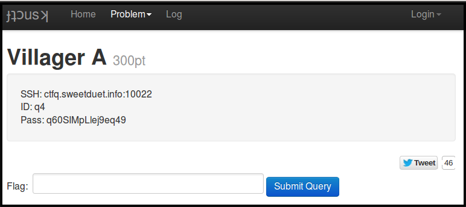

[ksnctf](http://ksnctf.sweetduet.info) is one of the beginner level CTF websites. This article is the write-up for the question 4 [Villager A](http://ksnctf.sweetduet.info/problem/4), in which you need to exploit the *Format String Vulnerability* to capture the flag!  

## Write-up
### __Connect__  
Using given information, access to the server `ssh -p 10022 q4@ctfq.sweetduet.info`  
In the server, you can find
```
[q4@localhost ~]$ ls -al
total 36
drwxr-xr-x.  2 root root 4096 May 22  2012 .
drwxr-xr-x. 17 root root 4096 Oct  6  2014 ..
-rw-r--r--.  1 root root   18 Dec  2  2011 .bash_logout
-rw-r--r--.  1 root root  176 Dec  2  2011 .bash_profile
-rw-r--r--.  1 root root  124 Dec  2  2011 .bashrc
-r--------.  2 q4a  q4a    22 May 22  2012 flag.txt
-rwsr-xr-x.  1 q4a  q4a  5857 May 22  2012 q4
-rw-r--r--.  1 root root  151 Jun  1  2012 readme.txt
[q4@localhost ~]$ cat readme.txt 
You are not allowed to connect internet and write the home directory.
If you need temporary directory, use /tmp.
Sometimes this machine will be reset.
[q4@localhost ~]$ cat flag.txt
cat: flag.txt: Permission denied
[q4@localhost ~]$ ./q4 
What's your name?
sirius
Hi, sirius

Do you want the flag?
yes
Do you want the flag?
yes
Do you want the flag?
no
I see. Good bye.
```

### __Analyze__  
Since I don't have an access to read flag.txt, it seems that I need to somehow exploit q4 (SUID=root) to read the file.  
Let's disassemble.  

```
...
0x080485e4 <+48>:	call   0x8048484 <fgets@plt>
0x080485e9 <+53>:	mov    DWORD PTR [esp],0x80487b6
0x080485f0 <+60>:	call   0x80484b4 <printf@plt>		<==
0x080485f5 <+65>:	lea    eax,[esp+0x18]
0x080485f9 <+69>:	mov    DWORD PTR [esp],eax
0x080485fc <+72>:	call   0x80484b4 <printf@plt>		<==
0x08048601 <+77>:	mov    DWORD PTR [esp],0xa
0x08048608 <+84>:	call   0x8048474 <putchar@plt>		<==
0x0804860d <+89>:	mov    DWORD PTR [esp+0x418],0x1
0x08048618 <+100>:	jmp    0x8048681 <main+205>
0x0804861a <+102>:	mov    DWORD PTR [esp],0x80487bb
0x08048621 <+109>:	call   0x80484c4 <puts@plt>
...
```
```
(gdb) c
Continuing.
What's your name?

Breakpoint 2, 0x080485e4 in main ()
(gdb) nexti
hello
0x080485e9 in main ()
(gdb) x/s 0x80487b6
0x80487b6 <__dso_handle+22>:	 "Hi, "
(gdb) x/s $esp+0x18
0xbf9524d8:	 "hello\n"
```
It seems that at \<main+48\>, `fgets()` is called to get a string from stdin; at \<main+72\>, `printf()` is called to output the string. But, it's kind of weird that `printf()` was called at \<main+60\> to output "Hi, ", and after that, `putchar()` was called to output "\n" (0xa). Why are they called separately, instead of calling just one like `printf("Hi, %s\n", input);` as you probably more familiar to write. Now, I'm getting suspicious that there is a format string vulnerability in this program.  
What if I input some kind of *format string* at \<main+48\>?  

```
[q4@localhost ~]$ ./q4
What's your name?
sirius%x%x%x
Hi, sirius400d604408

Do you want the flag?
```

It's now clear that there is a format string vulnerability in this program. So, let's think about how to exploit it to read flag.txt.  
  
```
...
0x08048601 <+77>:	mov    DWORD PTR [esp],0xa
0x08048608 <+84>:	call   0x8048474 <putchar@plt>
0x0804860d <+89>:	mov    DWORD PTR [esp+0x418],0x1		<==
0x08048618 <+100>:	jmp    0x8048681 <main+205>
...
0x08048681 <+205>:	mov    eax,DWORD PTR [esp+0x418]		<==
0x08048688 <+212>:	test   eax,eax
0x0804868a <+214>:	setne  al
0x0804868d <+217>:	test   al,al
0x0804868f <+219>:	jne    0x804861a <main+102>				<==
0x08048691 <+221>:	mov    DWORD PTR [esp+0x4],0x80487e6
0x08048699 <+229>:	mov    DWORD PTR [esp],0x80487e8
0x080486a0 <+236>:	call   0x80484a4 <fopen@plt>
0x080486a5 <+241>:	mov    DWORD PTR [esp+0x41c],eax
0x080486ac <+248>:	mov    eax,DWORD PTR [esp+0x41c]
0x080486b3 <+255>:	mov    DWORD PTR [esp+0x8],eax
0x080486b7 <+259>:	mov    DWORD PTR [esp+0x4],0x400
0x080486bf <+267>:	lea    eax,[esp+0x18]
0x080486c3 <+271>:	mov    DWORD PTR [esp],eax
0x080486c6 <+274>:	call   0x8048484 <fgets@plt>
0x080486cb <+279>:	lea    eax,[esp+0x18]
0x080486cf <+283>:	mov    DWORD PTR [esp],eax
0x080486d2 <+286>:	call   0x80484b4 <printf@plt>
...(return)
```
Realize that 0x1 is moved into [esp+0x418] right before the jump to \<main+205\>. Then, 0x1 is brought back to eax, followed by `jne` at \<main+219\> -- if the value of eax is not 0 (or ZF = 0), it jumps to \<main+102\> that is a loop asking "Do you want the flag?", as shown below.  


```
...
0x0804861a <+102>:	mov    DWORD PTR [esp],0x80487bb
0x08048621 <+109>:	call   0x80484c4 <puts@plt>
0x08048626 <+114>:	mov    eax,ds:0x8049a04
0x0804862b <+119>:	mov    DWORD PTR [esp+0x8],eax
0x0804862f <+123>:	mov    DWORD PTR [esp+0x4],0x400
0x08048637 <+131>:	lea    eax,[esp+0x18]
0x0804863b <+135>:	mov    DWORD PTR [esp],eax
0x0804863e <+138>:	call   0x8048484 <fgets@plt>
0x08048643 <+143>:	test   eax,eax
0x08048645 <+145>:	sete   al
0x08048648 <+148>:	test   al,al
0x0804864a <+150>:	je     0x8048656 <main+162>
0x0804864c <+152>:	mov    eax,0x0
0x08048651 <+157>:	jmp    0x80486dc <main+296>
0x08048656 <+162>:	mov    DWORD PTR [esp+0x4],0x80487d1
0x0804865e <+170>:	lea    eax,[esp+0x18]
0x08048662 <+174>:	mov    DWORD PTR [esp],eax
0x08048665 <+177>:	call   0x80484e4 <strcmp@plt>
0x0804866a <+182>:	test   eax,eax
0x0804866c <+184>:	jne    0x8048681 <main+205>
0x0804866e <+186>:	mov    DWORD PTR [esp],0x80487d5
0x08048675 <+193>:	call   0x80484c4 <puts@plt>
0x0804867a <+198>:	mov    eax,0x0
0x0804867f <+203>:	jmp    0x80486dc <main+296>
...
```

On the other hand, if the jump was not taken, then it opens `flag.txt` and print it out.  
One possibility to attack this program is by using format string attack to change the value of [esp+0x418] to 0 before `jne` at \<main+219\>, but it wouldn't work because `mov [esp+0x418], 0x1` happens after the string vulnerability. Moreover, ASLR (Address Space Layout Randomization) is enabled on this system, so guessing the stack address of [esp+0x418] is very hard.  
  

### __Exploitation__  
Remember that ASLR doesn't disable the randomization of memory address of code section. If I can somehow set `eip` to \<main+221\> (0x08048691), I should be able to read `flag.txt`.

